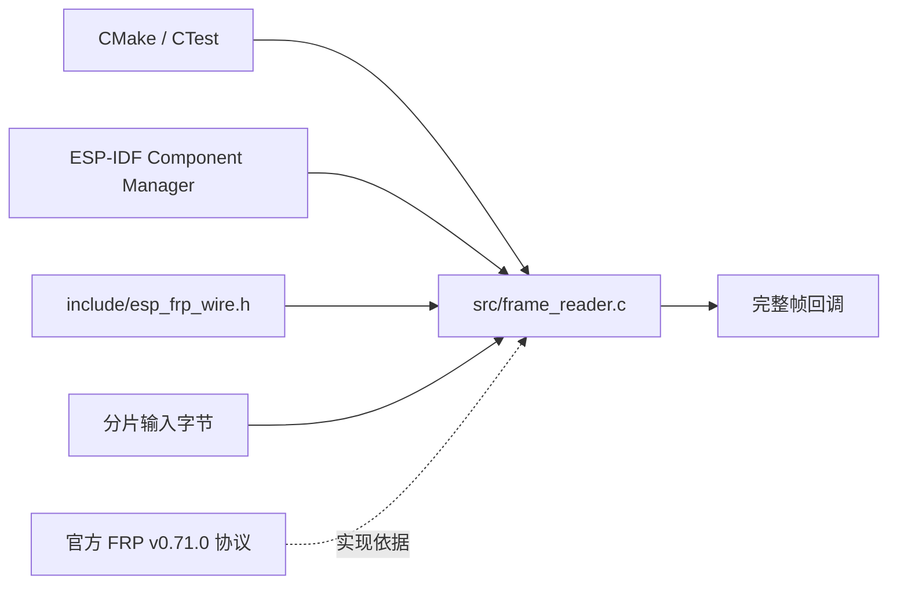

# ESP FRP

独立的 ESP-IDF FRP 客户端组件，采用 Apache-2.0。当前实现为 wire v2 增量帧编解码，完整客户端、TLS/Yamux/AEAD 和实板互操作尚在开发，不能作为可用 FRPC 发布。

## 架构拓扑



## 独立开发

```bash
cmake -S . -B build -DBUILD_TESTING=ON
cmake --build build
ctest --test-dir build --output-on-failure
```

依赖 C11 编译器、CMake >=3.16。无需 ESP、Token、私有仓或相邻 checkout 即可运行 host 测试。IDF 组件入口为根 `CMakeLists.txt` 与 `idf_component.yml`；target 验证限定 ESP-IDF v6.1 / ESP32-C3。

`efrp_wire_init` 借用调用者缓冲区，输入指针不被保留。feed 支持拆帧与粘帧，只有完整帧才回调；EOF 用 finish 检查截断。最大 wire payload 为 65536 字节；header 与 payload 独立计数，非法输入后 reader 永久失败，必须重建连接再初始化。回调 payload 只在回调期间有效，不允许回调重入。该 parser 不是 TLS、Yamux 或 AEAD parser，不能将未经认证的 AEAD 明文直接交给它。

- [来源](docs/design/source_provenance.md)
- [客户端合同](docs/design/client_contract.md)
- [扩展 Roadmap](ROADMAP.md)
- [FRP 工程标准](https://github.com/darren-you/darren_space/blob/master/harness/docs/workspace/standards/frp/frp_golden_path.md)
