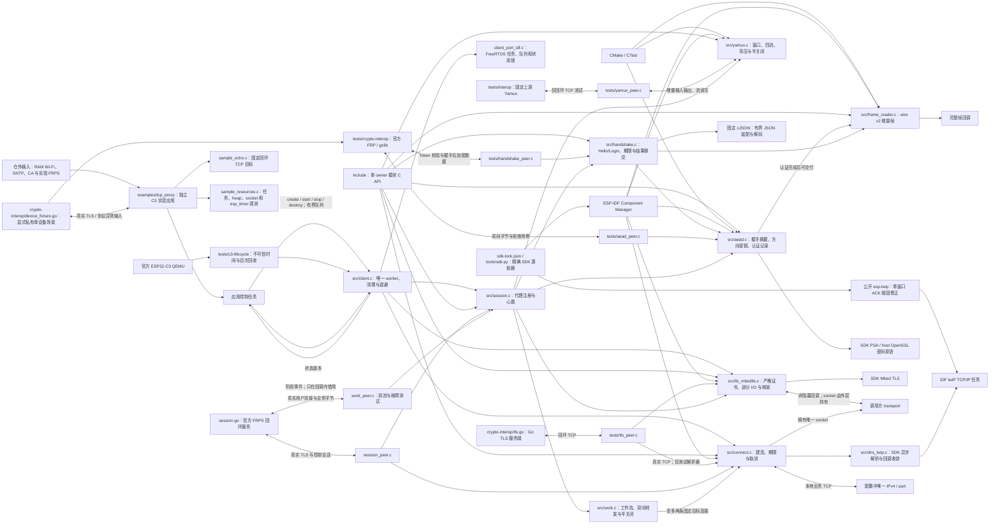

# ESP FRP

独立的 ESP-IDF FRP 客户端组件，采用 Apache-2.0。当前实现包含 wire v2 帧、有界 Yamux、Hello/Login、AES-256-GCM 控制记录、严格 TLS、单次 DNS/TCP 建连，以及代理注册、Token 心跳和固定本地目标 TCP 双向转发；单 worker 已组合生命周期与带抖动的重连。独立 C3 sample 已通过官方 FRPS 双流、DNS/TLS、部分异常协议及 `work-tail-fin` 实板互操作；完整工作流、Base/MQTT 组合资源与长稳尚未验收，不能作为已验收 FRPC 发布。

## 架构拓扑



`esp_frp.h` 是应用入口：create 深拷贝配置并创建一个空闲 worker；start 只表示命令入队，READY 需完成代理注册和首次认证 Pong。stop 等待连接、迟到 DNS 和回调收敛；超时保留句柄和停止请求，destroy 成功后任务及配置均已释放。网络中断使用单个退避截止时刻，证书、认证和协议错误进入 failed。详见[客户端生命周期](docs/design/client-lifecycle.md)。

ESP 构建必须使用 [sdk-lock.json](sdk-lock.json) 锁定的 ESP-IDF v6.1 公开维护 fork `578cf89c343e388db43ba1f4ddcd602fedcb763c` 与公开 ESP lwIP 修正提交；fork 从官方 `fff9895c82d744c7237be8847347bdd1b07c6643` 派生，依次修复 `esp_ota_begin` 擦除失败后的句柄泄漏和 HTTP 客户端初始化失败时的传输句柄泄漏；准备及验证见 [SDK 工具](tools/README.md)。原 SDK 存在已实板复现的双向零窗口 ACK 循环，构建会拒绝原始 lwIP、版本漂移或外部组件替换。修正不改变 FRP/TLS 容量；最新独立样例双流压力测试的最低 heap 已超过 48 KiB，但 Base/MQTT 组合预算和完整实板矩阵仍待验收，详见 [C3 问题记录](docs/issues/c3-loopback-memory-pressure.md)。

## 独立开发

[独立 C3 TCP 样例](examples/tcp_proxy/README.md) 使用仓外输入装配 RAM Wi-Fi、可信 SNTP、严格 TLS 与回环 echo；支持重复创建、重启、网络中断和资源采样，不读取 Base 配置或写 NVS。默认空输入只供编译，真实设备必须先核对其分区与恢复基线。

[C3 生命周期故障探针](tests/c3-lifecycle/README.md)使用公开占位输入，在官方 QEMU 检查真实 FreeRTOS worker 的不可信时间拒绝和百次销毁回收；验证范围与实板边界见[运行记录](docs/operations/p4-c3-qemu-lifecycle.md)。

```bash
cmake -S . -B build -DBUILD_TESTING=ON
cmake --build build
ctest --test-dir build --output-on-failure
```

依赖 C11 编译器、CMake >=3.16、OpenSSL >=3.0 开发库和 cJSON 1.7.19 开发包；非系统路径用 `-DOPENSSL_ROOT_DIR=...` 和 `-DCMAKE_PREFIX_PATH=...` 指定。无需 ESP、真实 Token、私有仓或相邻 checkout 即可运行 host 测试。IDF 组件入口为根 `CMakeLists.txt` 与 `idf_component.yml`，使用 SDK PSA 密码 API，并固定 `espressif/cjson ==1.7.19~2`；Token 协议需要启用 `CONFIG_MBEDTLS_MD5_C`，严格 TLS 必须开启 `CONFIG_MBEDTLS_HAVE_TIME_DATE=y`。target 验证限定 ESP-IDF v6.1 / ESP32-C3。PSA 与完整 Mbed TLS 后端也可用显式官方源码运行 host 测试，详见[测试入口](tests/README.md)。

`efrp_wire_init` 借用调用者缓冲区，输入指针不被保留。feed 支持拆帧与粘帧，只有完整帧才回调；EOF 用 finish 检查截断。最大 wire payload 为 65536 字节；header 与 payload 独立计数，非法输入后 reader 永久失败，必须重建连接再初始化。回调 payload 只在回调期间有效，不允许回调重入。该 parser 不是 TLS、Yamux 或 AEAD parser，不能将未经认证的 AEAD 明文直接交给它。

`esp_frp_yamux.h` 提供单 owner、无分配、无 socket 的客户端核心。四流各用 1 KiB ring，协议初始窗口保持 256 KiB；可增量接收大于 ring 的 DATA。调用方定期 tick，显式消费串流和输出；仅当完整 WindowUpdate 已交给 transport 才归还接收信用。慢流超时 RST、释放后数据有界排空、半关闭与 PING/GOAWAY 均有 host 回归。完整合同和限制见 [Yamux 核心](docs/design/yamux-core.md)。

`esp_frp_aead.h` 对原始 Hello payload 做 SHA-256 摘要与 HKDF-SHA256 双向密钥派生；接收端必须提供 65552 字节工作区，在完整 GCM tag 验证前不暴露明文，失败后清零并永久拒绝复用。发送端支持小记录与部分输出，nonce 来自密码随机源，单方向限制 2^32 条记录。仅支持协商 `aes-256-gcm`；Hello 语义由握手层验证。详见 [AEAD 合同](docs/design/aead-records.md)。

`esp_frp_handshake.h` 生成 ClientHello/Login，验证 ServerHello/LoginResp 并移交方向密钥和 run ID。它必须运行在已完成严格 TLS 的 Yamux 控制流上；不自行建立网络连接。支持部分输出、10 秒绝对期限、4 KiB 握手 payload 上限和精确的加密尾数据保留；完整消费 LoginResp 后，余下字节交给 AEAD。详见 [握手合同](docs/design/control-handshake.md)。

可选上游 Yamux 互操作检查需要 POSIX 宿主和 Go >= 1.23，以 `-DEFRP_TEST_UPSTREAM_YAMUX=ON` 配置后运行 CTest。AEAD 官方交叉验证使用 Go >=1.25 与 `-DEFRP_TEST_UPSTREAM_CRYPTO=ON`。两者各自固定公开 Go 依赖，不读取相邻仓或生产 FRPS；默认 host 检查不依赖 Go 或外网，POSIX 连接测试会使用回环 TCP。具体命令见[测试入口](tests/README.md)。

`esp_frp_tls.h` 对已连接的非阻塞 transport 提供严格 TLS；证书、身份、日期与 owner 的可信时间条件均须满足，1036 字节自有发送队列保持 SDK 重试指针稳定，握手/写入/关闭受绝对期限约束。终止后释放会话并停止回调，由外层关闭 socket。它不执行 DNS 或创建任务，详见 [TLS 合同](docs/design/tls-transport.md)。IDF 与显式 `EFRP_MBEDTLS_SOURCE_DIR` host 构建导出 `EFRP_HAS_TLS=1`；默认 OpenSSL/独立 PSA 构建只验证协议核心，导出 0 且不包含 TLS 符号。

`esp_frp_connect.h` 在 IDF 提供一次 IPv4 DNS/TCP 尝试，也支持无需 DNS 的固定 IPv4 本地目标，使用现有 lwIP 任务与非阻塞 socket；必须开启 `CONFIG_LWIP_SO_LINGER=y`。取消后不再建连，已发 DNS 查询仍须等 SDK 回调收敛，destroy 只在资源释放后成功；close_write/finish 提供工作流的正常半关闭和排空路径，不自行重连。详见 [连接生命周期](docs/design/connection-lifecycle.md)。IDF 导出 `EFRP_HAS_CONNECT=1`，正常 host 库为 0；host 网络测试单独链接仅测试解析器。应用客户端同样只在 IDF 导出 `EFRP_HAS_CLIENT=1`；POSIX 调度适配仅供测试。

`esp_frp_session.h` 在已 OPEN 的借用 TLS 上组合控制链路，注册单一 TCP proxy、执行 15 秒 Token 心跳并校验 10 秒响应期限。工作流执行 magic/NewWorkConn/StartWorkConn，向配置的唯一 IPv4/port 转发，最多两条活跃流和一条预备流；对端地址元数据不能更换本地目标。四层背压、握手后尾数据与独立半关闭保持完整，Yamux 信用在 TLS 实际排空后归还。destroy 返回 WOULD_BLOCK 时继续保留句柄，直到本地 socket 清理完成，再销毁 TLS 和外层连接。详见 [控制会话](docs/design/control-session.md) 与[工作流](docs/design/work-streams.md)。该模块在 IDF 或完整 Mbed TLS host 模式编译；host 会话测试显式链接连接测试适配库，不把 DNS fixture 发布为 host runtime。

- [来源](docs/design/source-provenance.md)
- [客户端合同](docs/design/client-contract.md)
- [扩展 Roadmap](ROADMAP.md)
- [FRP 工程标准](https://github.com/darren-you/darren-space/blob/master/harness/docs/workspace/standards/frp/frp_golden_path.md)
