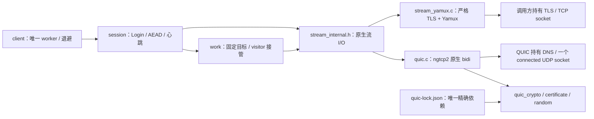

# 流传输与所有权

0.3.0 候选让 `session` 与 `work` 只消费统一的原生双向流。TCP 使用严格 Mbed TLS 和 Yamux；QUIC 使用固定 ngtcp2、Picotls minicrypto 与 Mbed TLS X509/PSA，不叠加 Yamux。该接口由第二种真实传输所需的行为决定，不新增 worker、并行重连器或独立定时任务。

## 应用与会话入口

应用配置的 `transport` 缺省为 `EFRP_TRANSPORT_YAMUX_TLS`，此时 `quic_profile` 必须为零。选择 `EFRP_TRANSPORT_QUIC` 时必须显式配置 `EFRP_QUIC_PROFILE_P256_AES128_X25519`。该窄配置支持 TLS 1.3 的 ECDSA P-256/SHA-256 签名、AES-128-GCM/SHA-256 和 X25519，ALPN 为 `frp`；没有 RSA、其他曲线、0-RTT 或会话票据支持承诺。provider 与独立 STCP/XTCP visitor 的主 FRPS 控制链使用相同传输选择。XTCP child peer 有独立 typed factory、角色证书与 `esp-frp-xtcp/1` ALPN，不能用主 FRPS CA client 工厂替代。证书、Token、可信时间和业务授权合同继续生效。

直接组合模块时，先取得 OPEN 的 `efrp_transport_t`，再传给 `efrp_session_create`。TCP 调用 `efrp_transport_yamux_create`，借用已经 OPEN 且无待写字节的严格 TLS；QUIC 调用 `efrp_transport_quic_create`，复制主机名、解析 CA 并拥有 DNS 和 UDP。状态中的 `kind` 是真实后端身份，会话据此填写 Hello 的 `transport` 与 `tcpMux`，不相信调用方填写的 Login bootstrap。

销毁顺序为 session → transport → 调用方的 TLS → TCP connect。QUIC 没有外层 TCP/TLS 句柄。destroy 只有 OK 才释放并置空，未完成 DNS 回调或 SDK socket 关闭必须保留句柄重试。取消首先终结协议对象的借用关系，再清零数据，不能把未完成的业务队列发送出去。

## 原生流与有界内存

私有流 ID 为 64 位原生值。`EFRP_STREAM_NONE=UINT64_MAX` 表示不存在，QUIC 流 0 合法；不能用真假判断或 32 位中间值识别流。每连接最多四个 live stream 槽。主 FRPS 连接使用客户端发起 bidi，容纳控制、一个预备工作流和两条业务流；XTCP visitor 打开、provider 接受真实 client bidi，reserved0 proof 完成并释放后才允许 ID≥4 的业务流。容量或远端 credit 不足返回 WOULD_BLOCK，待办请求继续由原 owner 持有。

QUIC 每流有 1024 字节接收区和 2048 字节发送环。write 只复制能接受的前缀，调用方随即可以改写原缓冲；ngtcp2 在 ACK 或 stream close 前借用的字节保持原位不变。read 只为真正交给应用的字节归还 flow credit。FIN 保留此前所有字节且只关闭一个方向，reset 单独报告，不能伪装成 EOF。官方 FRPS 在正常 EOF 后可能发送 STOP_SENDING(0)；只有 TX 方向错误为零、已有 remote FIN 且 TX 全部 ACK/无 pending 时才保留接收语义，仍等待应用真实本地 EOF/FIN。RX reset、非零错误或未确认发送数据均不能据此当作正常完成。

工作流结束后立即清零业务缓冲并关闭本地 TCP 或四个 UDP 来源 socket。QUIC stream close 尚未到达时，槽位和原生 ID 继续由 cleaning owner 持有，直到 release 成功。整个连接取消立即停止应用 I/O，清除旧业务报文，仅生成一次加密 CONNECTION_CLOSE。发送成功、失败或 5 秒绝对期限到达后，先删除 ngtcp2 借用引用，再清零/释放 stream ring 并清理 socket/DNS；只有 EAGAIN 会保留该关闭包，由原 step 推进同一期限；五秒不保证迟到 DNS 或 SDK socket 已释放，这些资源仍保留实际 owner，step/destroy 返回 WOULD_BLOCK 直到真正收敛。工作组同时回收本地资源，不因等待 native close 留住本地业务 socket。

TCP pump 保留未消费的 TLS 输入后缀。物理 EOF 不伪造某条流的 FIN；会话排空控制缓冲和已认证明文后，才检查传输帧是否完整。合法背压后缀继续排空，半 header/body 仍返回 TRUNCATED。时间由唯一 owner 推进，后端只报告实际协议期限和 pacing，不制造额外轮询 timer。

## 构建与验收范围

正式源码和独立原型共用 `src/quic_crypto.c`、`quic_certificate.c`、`quic_random.c`，正式 peer 另使用同源 `quic_peer_security.c`；精确依赖统一由 `quic-lock.json` 冻结。helper 来源和许可见[来源正文](source-provenance.md)。构建不从 tests 导入运行时代码，不修改仓外依赖。两个精确 checkout 通过 [工具入口](../../tools/README.md) 准备；host 和 IDF 都显式传入相同的 `EFRP_NGTCP2_SOURCE_DIR`／`EFRP_PICOTLS_SOURCE_DIR`。

当前是软件候选。原型、正式 factory、完整 C 会话、维护 XTCP 候选全链路及两目标编译分别记账，当前通过结果见[软件检查点](../verification/xtcp-candidate-software-20261003.md)；它们不代替实板握手、异网、Base/MQTT 组合资源、完整生命周期或长稳验收。XTCP peer 有独立信令和身份绑定合同，不能通过主 FRPS 的 CA client 入口关闭证书检查来打通连接。
