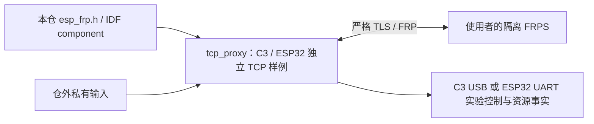

# 独立样例

样例只依赖本仓、固定 ESP-IDF 和公开组件，实验镜像不作为产品或 OTA 发布。先编译，再按实际目标和恢复基线单独授权、执行设备写入。

## 架构拓扑

```mermaid
flowchart LR
    library["本仓 esp_frp.h / IDF component"] --> sample["tcp_proxy：C3 / ESP32 独立 TCP 样例"]
    inputs["仓外私有输入"] --> sample
    sample <-->|"严格 TLS / FRP"| server["使用者的隔离 FRPS"]
    sample --> serial["C3 USB 或 ESP32 UART 实验控制与资源事实"]
```

[TCP 样例](tcp_proxy/README.md)用于真实网络、生命周期与资源验证，无 GPIO 动作，也不读写 ESP Base 的身份或配置格式。
