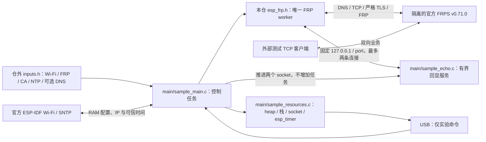

# C3 TCP Proxy 样例

此样例独立使用 `esp_frp.h`，固定 ESP-IDF v6.1 / ESP32-C3 与 [sdk-lock.json](../../sdk-lock.json) 中的 lwIP 修正提交，带 `ESP_FRP_LAB_ONLY TCP_PROXY` 镜像标记。先按 [SDK 工具说明](../../tools/README.md) 准备独立 SDK；原始 SDK 的零窗口缺陷会被构建守卫拒绝。当前用于开发和实机资源验收，不能作为已验收产品固件。

## 架构拓扑



## 构建与输入

默认占位输入可以编译，运行时在初始化网络前停止。通过显式路径注入本轮私有 header；它的字节会复制进 build 并编入镜像，输入、build、镜像和运行日志均须存放在受限目录，不提交真实资料：

```bash
source "$IDF_PATH/export.sh"
idf.py -C examples/tcp_proxy -B /private/path/frp-build \
  -D SDKCONFIG=/private/path/frp-sdkconfig \
  -D EFRP_SAMPLE_INPUTS=/private/path/inputs.h build
```

从 `inputs.example.h` 开始，填写自己的 Wi-Fi、NTP、唯一 FRPS 域名/端口、CA、Token 和代理身份。样例只允许 `127.0.0.1` 作为本地目标，port 指定回显 listener；库本身仍支持配置中的单一固定 IPv4 目标。`remote_port=0` 让隔离 FRPS 分配端口，成功状态中的 `remote=` 用于本轮连接。这里不读取相邻 ESP Base、私有工作区配置或生产 FRPS catalog。

`sample_dns_ipv4` 为空时使用 DHCP 提供的正常 DNS；填入明确 IPv4 时，每次获得 IP 后将其设置为唯一主 DNS，并清空备用位置，适合本机隔离 DNS fixture。证书身份仍是 `server_hostname`，不能用绕过身份校验替代 DNS。NTP 应是可信且可达的时间来源；收到实际同步后才启动 FRP，超过两小时未再次同步则可信条件失效。

默认仅指定 C3 / 4 MiB，使用 SDK 默认分区，并不等于某块既有设备的可刷布局。给已有板测试时，在仓外准备其已核对的完整 sdkconfig/分区表或额外 `SDKCONFIG_DEFAULTS`；样例不导入其他仓的分区文件。编译不执行 flash。必须重新枚举、验证芯片/Flash/UUID和活动分区，保存两份一致的完整基线，再单独决定应用槽写入。测试后恢复整个原应用槽并核对非应用分区及身份；禁止照抄 build 输出里的全盘写入命令。

Wi-Fi 使用 `nvs_enable=false` 和 RAM storage，PHY 校准持久化必须关闭；样例不初始化、擦除、读写 NVS，不驱动 GPIO。已有身份和配置不是本例的运行依赖，也不是通过串口端点猜出的身份。

## 实验操作

USB Serial/JTAG 输入为一行一个精确命令，最多 63 个 ASCII 字符；超长或非法行整行拒绝。它不是产品设备控制协议，无 UUID/业务 ACK 或远程写权限含义。主机须独占端点并持续读取输出：

- `stats`：状态、回显计数、任务栈、socket 和 esp_timer。
- `restart`：同一实例 stop/start；`stop`、`start` 单独控制。
- `cycle`：保存已验证 run_id，完整 destroy，报告销毁后资源，再 create/start 并重新鉴权；统计 cycle 必须逐次确认，不能把命令写入当作成功。
- `wifi_down`、`wifi_up`：停止/启动本板 station，让已有 FRP worker 处理网络中断与恢复；不代表外部 AP 或人工断电验收。
- `echo_off`、`echo_on`：取消/恢复板内 listener，用于本地拒绝与连接中断。

回显服务只有两个 1024 字节缓冲，由 main 推进。它只在板内回环监听，不提供未鉴权的局域网实验控制入口。首个 FRP READY 需完成严格 TLS、注册与认证 Pong；业务字节仍应由外部测试客户端逐字节或摘要核对。

## 资源与边界

状态采样报告当前 AP 的 `rssi_dbm`；仅 `rssi_valid=1` 时有效，断线时不能把占位零值当信号强度。资源采样包含 heap、全程最低 heap、最大连续块、所有当前任务的栈余量、有界描述符扫描、SDK 分配失败次数/最后失败尺寸和 esp_timer 列表。分配失败回调只写原子计数，不在分配路径打印或申请内存。C3 暂停调度后复制任务名，避免跨采样借用 TCB；超过 32 个任务时数量为零，表示采样不完整。socket 扫描可能与 SDK 开关连接并发，需分别比较稳定在线和销毁后样本；它不是原子网络快照。esp_timer profiling 也不是全部 FreeRTOS/lwIP 计时资源枚举。

样例将 Wi-Fi 静态 RX 数量设为 6（与 RX BA 窗口相同），动态 RX/TX 各 12，TCP 收发窗口各 2880 字节（两个默认 MSS）。这是为 C3 双流约束瞬态队列占用的装配配置，会限制吞吐；不改变 FRP、Yamux 或 AEAD 的协议容量，也不要求使用该库的其他应用照搬。

串口输出和诊断本身消耗资源，实验配置使用 4 KiB main 栈，FRP worker 使用 8 KiB；两者根据 C3 高水位采样从较大的初始预算收敛，每次修改仍需实板压力复核。完整样例包含 Wi-Fi、TLS、AEAD、四条 Yamux 流、两条 work socket 及回环对端，不能仅以静态对象大小或 host 数据推断内存安全。

真实验收须覆盖 DNS/TLS/FRPS、双流大载荷和背压、拒绝/错误认证、服务重启、百次完整客户端释放及资源峰值。当前人工断电由维护者明确暂缓，未执行项不计通过；软重启、station 停启或软件注入不能替代断电。
