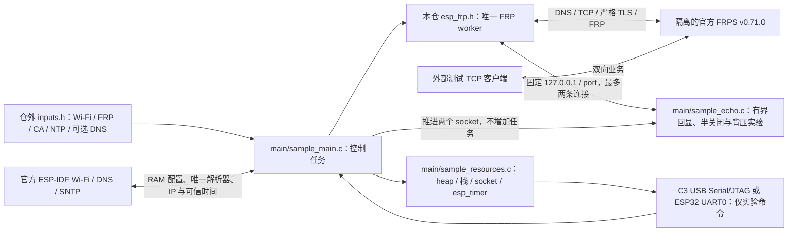

# TCP Proxy 独立样例

此样例独立使用 `esp_frp.h`，固定 ESP-IDF v6.1 / ESP32-C3 或 ESP32-D0WD-V3（IDF target `esp32`）与 [sdk-lock.json](../../sdk-lock.json) 中的 lwIP 修正提交，带 `ESP_FRP_LAB_ONLY TCP_PROXY` 镜像标记。先按 [SDK 工具说明](../../tools/README.md) 准备独立 SDK；原始 SDK 的零窗口缺陷会被构建守卫拒绝。当前用于开发和实机资源验收，不能作为已验收产品固件。

## 架构拓扑



## 构建与输入

默认占位输入可以编译，运行时在初始化网络前停止。通过显式路径注入本轮私有 header；它的字节会复制进 build 并编入镜像，输入、build、镜像和运行日志均须存放在受限目录，不提交真实资料：

```bash
source "$IDF_PATH/export.sh"
idf.py -C examples/tcp_proxy -B /private/path/frp-build \
  -D SDKCONFIG=/private/path/frp-sdkconfig \
  -D IDF_TARGET=esp32c3 \
  -D EFRP_SAMPLE_INPUTS=/private/path/inputs.h build
```

ESP32-D0WD-V3 使用独立的 build、sdkconfig 和相同私有输入格式，将 `IDF_TARGET` 改为 `esp32`。该 target 读取 `sdkconfig.defaults.esp32`，经 UART0 控制台收发实验命令，并以单核实验配置保证任务名快照不会与另一核的任务删除竞争；它只验证 ESP32 芯片上的本样例，不替代未来 Base 双核组合资源验收。C3 读取 `sdkconfig.defaults.esp32c3`，保留原 USB Serial/JTAG 路径。`dependencies.lock.esp32` 与原 C3 锁分离，构建后须核对最终 target、组件摘要及镜像身份，不得混用两套制品。

从 `inputs.example.h` 开始，填写自己的 Wi-Fi、NTP、唯一 FRPS 域名/端口、CA、Token 和代理身份。样例只允许 `127.0.0.1` 作为本地目标，port 指定回显 listener；库本身仍支持配置中的单一固定 IPv4 目标。`remote_port=0` 让隔离 FRPS 分配端口，成功状态中的 `remote=` 用于本轮连接。这里不读取相邻 ESP Base、私有工作区配置或生产 FRPS catalog。

`sample_dns_ipv4` 为空时使用 DHCP 提供的正常 DNS；填入明确 IPv4 时，每次获得 IP 后将其设置为唯一主 DNS，并清空备用位置，适合本机隔离 DNS fixture。SDK 的 `esp_netif_set_dns_info` 拒绝零地址，因此备用位置通过 `tcpip_callback_wait` 在 lwIP 线程清空，完成后才启动 SNTP。证书身份仍是 `server_hostname`，不能用绕过身份校验替代 DNS。NTP 应是可信且可达的时间来源；收到实际同步后才启动 FRP，超过两小时未再次同步则可信条件失效。

默认两目标均按 4 MiB 和 SDK 默认分区构建，并不等于某块既有设备的可刷布局。给已有板测试时，在仓外准备其已核对的完整 sdkconfig/分区表或额外 `SDKCONFIG_DEFAULTS`；样例不导入其他仓的分区文件。编译不执行 flash。必须重新枚举、验证芯片/Flash/UUID和活动分区，保存两份一致的完整基线，再单独决定应用槽写入。测试后恢复整个原应用槽并核对非应用分区及身份；禁止照抄 build 输出里的全盘写入命令。

Wi-Fi 使用 `nvs_enable=false` 和 RAM storage，PHY 校准持久化必须关闭；样例不初始化、擦除、读写 NVS，不驱动 GPIO。已有身份和配置不是本例的运行依赖，也不是通过串口端点猜出的身份。

## 实验操作

所选控制台（C3 USB Serial/JTAG、ESP32 UART0）输入为一行一个精确命令，最多 63 个 ASCII 字符；超长或非法行整行拒绝。它不是产品设备控制协议，无 UUID/业务 ACK 或远程写权限含义。主机须独占端点并持续读取输出：

- `stats`：状态、回显计数、任务栈、socket 和 esp_timer。
- `restart`：同一实例 stop/start；`stop`、`start` 单独控制。
- `stop_poll`、`stop_short`：分别以零等待和 50 ms 调用 stop；迟到 DNS 尚未收敛时，应分别返回 WOULD_BLOCK / TIMEOUT，并保留句柄与停止请求。之后仍须等 `stop` 成功。
- `destroy_short`、`destroy`：分别以 50 ms / 30 秒调用 destroy；只有成功才释放并清空句柄，报告销毁后资源，不自动新建。使用 `start` 可重新创建。
- `cycle`：保存已验证 run_id，完整 destroy，报告销毁后资源，再 create/start 并重新鉴权；统计 cycle 必须逐次确认，不能把命令写入当作成功。
- `wifi_down`、`wifi_up`：停止/启动本板 station，让已有 FRP worker 处理网络中断与恢复；不代表外部 AP 或人工断电验收。
- `echo_off`、`echo_on`：取消/恢复板内 listener，用于本地拒绝与连接中断。
- `echo_local_fin`：仅在没有活动连接和待用实验模式时，为下一条连接准备半关闭实验。先增量发送 300001 字节固定模式并关闭写方向，再逐字节校验对端随后发送的 300001 字节，最后报告 `EFRP_SAMPLE_ECHO_PROOF`；完整长度、零 mismatch、双方 EOF 和未取消共同决定 `valid=1`。
- `echo_stall`：同样只影响下一条连接，暂停其读取；第二条连接仍正常回显。`echo_resume` 只恢复唯一暂停连接，供故障结束后的目标 socket 清理使用。
- `echo_reset`：仅有一条活动本地连接时，请求零 linger 关闭该连接；仅在 fd 已关闭时返回成功，关闭失败保留 fd，由主循环继续清理。`work-shared` 实验须先用 `echo_stall` 暂停该连接并等待 `pending_read=1`，再核对命令成功、远端 RST 与 work 失败状态；命令回执本身不是 RST 证明。

回显服务只有两个 1024 字节缓冲，由 main 推进；半关闭模式也用原缓冲增量生成/校验，不分配完整载荷。实验模式仅消费一次，`echo_off` 清除未使用的模式。它只在板内回环监听，不提供未鉴权的局域网实验控制入口。首个 FRP READY 需完成严格 TLS、注册与认证 Pong；业务字节仍应由外部测试客户端逐字节或摘要核对。

状态包含 `failure_phase`、`system_error` 和单调 `time_ms`，用于区分 DNS/TCP、TLS 与协议失败；工作流的 `requests`、`rejected`、`pending`、`cleaning` 分别记录请求/拒绝累计数和待处理/清理中数量，可与 `active`、`waiting`、`failed`、`work_error` 一同验证异常隔离和有界容量。命令回执记录实际返回值、耗时与句柄是否仍存在；短期限返回不能当作清理完成。

## 资源与边界

状态采样报告当前 AP 的 `rssi_dbm`；仅 `rssi_valid=1` 时有效，断线时不能把占位零值当信号强度。资源采样包含 heap、全程最低 heap、最大连续块、所有当前任务的栈余量、有界描述符扫描、SDK 分配失败次数/最后失败尺寸和 esp_timer 列表。分配失败回调只写原子计数，不在分配路径打印或申请内存。样例只在单核调度配置下暂停调度并复制任务名，避免跨采样借用 TCB；超过 32 个任务时数量为零，表示采样不完整。socket 扫描可能与 SDK 开关连接并发，需分别比较稳定在线和销毁后样本；它不是原子网络快照。esp_timer profiling 也不是全部 FreeRTOS/lwIP 计时资源枚举。

样例将 Wi-Fi 静态 RX 数量设为 6（与 RX BA 窗口相同），动态 RX/TX 各 12，TCP 收发窗口各 2880 字节（两个默认 MSS）。这是为 C3 双流约束瞬态队列占用的装配配置，会限制吞吐；不改变 FRP、Yamux 或 AEAD 的协议容量，也不要求使用该库的其他应用照搬。

串口输出和诊断本身消耗资源，实验配置使用 4 KiB main 栈，FRP worker 使用 6 KiB；两者根据 C3 高水位采样从较大的初始预算收敛。当前 6 KiB worker 的同板十轮双流压力采样中，最低栈余量为 3104 字节；ESP32 的栈、heap 和双流资源必须另测，不能沿用 C3 数值。完整样例包含 Wi-Fi、TLS、AEAD、四条 Yamux 流、两条 work socket 及回环对端，不能仅以静态对象大小或 host 数据推断内存安全。

真实验收须覆盖 DNS/TLS/FRPS、双流大载荷和背压、拒绝/错误认证、服务重启、百次完整客户端释放及资源峰值。维护者已于 2026-09-24 确认具备人工断电拔插测试条件，后续按[五仓主计划](https://github.com/darren-you/darren-space/blob/master/harness/docs/design/darren-space/global/esp-base-frp-mqtt-ota-container-development-plan.md)当前决定和对应实板前置执行；设备、分区与完整 Flash 恢复基线仍须逐轮核对，未执行项保持未验收。软重启、station 停启或软件注入不能替代断电。
