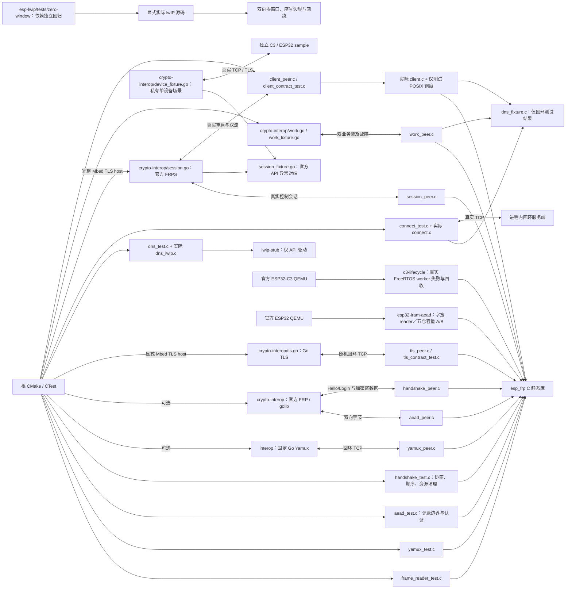

# ESP FRP 测试

## 架构拓扑



[C3 生命周期故障探针](c3-lifecycle/README.md)使用相同的 `esp-frp` 设备源码与 FreeRTOS port，在官方 QEMU 检验不可信时间拒绝和百次回收；这条设备软件路径不依赖 host POSIX 调度，结果见[运行记录](../docs/operations/p4-c3-qemu-lifecycle.md)。

默认 host 测试需 C11、CMake >= 3.16、OpenSSL >=3.0 和 cJSON 1.7.19 开发库；在仓库根执行：

```bash
cmake -S . -B build -DBUILD_TESTING=ON \
  -DCMAKE_C_FLAGS="-fsanitize=address,undefined -fno-omit-frame-pointer -g"
cmake --build build
ctest --test-dir build --output-on-failure
```

[lwIP 零窗口回环回归](https://github.com/esp-space/esp-lwip/blob/master/tests/zero-window/README.md) 是单独的 SDK 缺陷复现入口，直接编译显式提供的依赖源码，不混入 FRP host 通过结论。原始官方 SDK 会失败；[sdk-lock.json](../sdk-lock.json) 已锁定通过该回归的修正源依赖，不用预期失败规则将原始 SDK 标绿。SDK 身份与脏内容守卫使用 `python3 -m unittest discover -s tools/tests -p 'test_*.py'` 验证。

OpenSSL 不在系统路径时添加 `-DOPENSSL_ROOT_DIR=/absolute/path/to/openssl`；cJSON 不在系统路径时用 `-DCMAKE_PREFIX_PATH=/absolute/path/to/cjson`。ESP-IDF 构建固定使用 SDK PSA API 与 manifest 中精确锁定的 espressif/cjson，不使用 OpenSSL。

POSIX host 默认另外运行 `connect`、`connect_linger` 与 `dns_adapter`，需要系统线程库。`connect` 使用真实 socket 与仅测试 DNS 结果；`connect_linger` 用 socket 操作注入验证 IDF 正 linger 的暂时性失败与取消所有权，不模拟 SDK TCP/IP 任务或五秒实板时长；`dns_adapter` 直接编译实际 lwIP 适配代码，使用 API fixture 驱动 SDK 回调次序。正常 host 库不包含这些 fixture 或 SDK 连接层。DNS 竞争可单独用 ThreadSanitizer 验证：

```bash
cc -std=c11 -Wall -Wextra -Werror -g -fsanitize=thread \
  -Iinclude -Isrc -Itests/lwip-stub \
  src/dns_lwip.c tests/dns_test.c -pthread -o /tmp/esp-frp-dns-tsan
/tmp/esp-frp-dns-tsan
```

ASan 与 TSan 需分别构建。上述驱动验证所有权及竞争，不计作真实 SDK DNS 网络或 C3 调度验证，范围见 [连接生命周期](../docs/design/connection-lifecycle.md)。

AES-256-GCM 和 Hello/Login 官方互操作需 Go >=1.25，添加 `-DEFRP_TEST_UPSTREAM_CRYPTO=ON`，运行 `aead_upstream`、`handshake_upstream` 和 `handshake_esp32_upstream`。后两项分别以 `riscv32`、`xtensa` 核对官方 FRP v0.71.0 解码出的 Login，并完成 Token 鉴权、加密往返与拒绝用例；两方向、64 KiB、多记录及拒绝范围见 [crypto-interop](crypto-interop/README.md)。可以同时打开两个上游测试选项。

生产 PSA 适配器也能在 host 运行相同 CTest。准备官方 [TF-PSA-Crypto 1.1.0 发布包](https://github.com/Mbed-TLS/TF-PSA-Crypto/releases/tag/tf-psa-crypto-1.1.0)，使用完整 `tf-psa-crypto-1.1.0.tar.bz2`（SHA-256 `a0b011b7f2c427cc8ee70116bb2d859543014534ae4d7020a69613aec10dc1b4`），解包后显式传入其根目录：

```bash
cmake -S . -B build-psa -DBUILD_TESTING=ON \
  -DEFRP_PSA_SOURCE_DIR=/absolute/path/to/tf-psa-crypto-1.1.0 \
  -DGEN_FILES=OFF -DEFRP_TEST_UPSTREAM_CRYPTO=ON \
  -DCMAKE_C_FLAGS="-fsanitize=address,undefined -fno-omit-frame-pointer -g -DMBEDTLS_PSA_ASSUME_EXCLUSIVE_BUFFERS"
cmake --build build-psa
ctest --test-dir build-psa --output-on-failure
```

显式 PSA host 模式不再链接 OpenSSL。发布包包含生成文件，`GEN_FILES=OFF` 避免把上游代码生成工具引为本项目依赖。不要把 Espressif SDK 内经移植的 TF 子树当作独立官方 host 包；它依赖 SDK 的头文件与配置，生产芯片适配只由 IDF 编译验证。上面两个构建目录选择不同密码后端，用于交叉验证。

严格 TLS 测试使用官方 [Mbed TLS 4.1.0 完整发布包](https://github.com/Mbed-TLS/mbedtls/releases/tag/mbedtls-4.1.0)，文件 `mbedtls-4.1.0.tar.bz2` 的 SHA-256 为 `377a09cf8eb81b5fb2707045e5522d5489d3309fed5006c9874e60558fc81d10`。包内自带 TF-PSA-Crypto 1.1.0，不得同时设置 `EFRP_PSA_SOURCE_DIR`。需 POSIX 与 Go >=1.25：

```bash
cmake -S . -B build-tls -DBUILD_TESTING=ON \
  -DEFRP_MBEDTLS_SOURCE_DIR=/absolute/path/to/mbedtls-4.1.0 \
  -DGEN_FILES=OFF -DEFRP_TEST_UPSTREAM_CRYPTO=ON -DEFRP_TEST_UPSTREAM_YAMUX=ON \
  -DCMAKE_C_FLAGS="-fsanitize=address,undefined -fno-omit-frame-pointer -g -DMBEDTLS_PLATFORM_MEMORY -DMBEDTLS_PSA_ASSUME_EXCLUSIVE_BUFFERS"
cmake --build build-tls
ctest --test-dir build-tls --output-on-failure
```

该模式自动增加 `tls_upstream`，由 Go 标准 TLS 服务端生成临时 CA/证书并启动 C peer；包含 TLS 1.2/1.3、四类证书拒绝、部分 I/O、100 次连接、取消和期限。`MBEDTLS_PLATFORM_MEMORY` 仅为 host 分配失败注入；未开启时不执行分配注入段，其余合同测试仍执行。PSA 的独占输入模式与 SDK 对齐。TLS 测试总期限 180 秒，证书输入和监听均在测试内清理，详见 [TLS 合同](../docs/design/tls-transport.md)。

完整 Mbed TLS 模式也增加 `session_upstream`，总期限 240 秒。它在本机启动实际官方 FRPS，验证百次注册、Token 心跳、工作请求、部分 I/O、拒绝和取消；另有 28 种尾数据、容量、Yamux 非法 header、解析、认证、EOF 和超时场景。host 配置使用公开 fixture，监听仅回环，子进程和临时证书结束后清理；范围见 [控制会话](../docs/design/control-session.md)。[单设备入口](crypto-interop/README.md#单设备协议-fixture) 可用显式私有配置复用协议场景；它不负责刷机，服务端成功也不等于设备验收。

同一模式的 `work_upstream` 用实际 FRPS 验证 100 轮双业务流，共 200 条本地连接，每流双向各 300001 字节；总期限 240 秒。`work_faults_upstream` 总期限 180 秒，包含四个真实 FRPS 拒绝/取消场景和 13 个官方 API 半关闭、尾数据、解析、期限与慢流场景。连接目标是独立回环业务 listener；正常结束与取消均检查 fd 基线，详情见 [工作流](../docs/design/work-streams.md)。

同一候选源码下的完整 host/local 压力与工作流矩阵结果、精确复现命令和实板边界见 [P4-04 主机工作流矩阵](../docs/operations/p4-host-workflow-matrix.md)。

可选互操作需 macOS/Linux 与 Go >= 1.23；`tests/interop/go.mod` 和 `go.sum` 固定 FRP v0.71.0 的实际 Yamux replacement。首次运行可能下载该公开依赖，不读取生产配置或相邻源码：

```bash
cmake -S . -B build -DBUILD_TESTING=ON -DEFRP_TEST_UPSTREAM_YAMUX=ON
cmake --build build
ctest --test-dir build --output-on-failure
```

Go 测试启动随机回环 TCP 端口和本仓构建的 C peer，结束时回收进程、连接与监听；CTest 有 120 秒总期限。上游测试验证其实际 6 MiB 最大窗口配置与本核心 1 KiB ring 的互操作。该测试没有 TLS、FRP wire 登录或真实 MCU；边界和验收范围见 [Yamux 核心](../docs/design/yamux-core.md)。

完整 Mbed TLS 模式另外运行 `client_upstream`（240 秒）和 `client_contract`。前者使用实际 `client.c`、POSIX 测试调度和实际 FRPS，验证百次创建/注册/停止/销毁、同实例重复 start、双向业务和活动双流取消、真实 FRPS 重启恢复，以及 DNS 迟到、退避、取消、并发调用、回调收敛和信任/认证终止。活动流重启场景在两条业务流各交付一字节后关闭真实 FRPS，确认旧本地与远端 socket 关闭、worker 退避并重新注册，再由同一实例完成两条新的双向 300001 字节业务流；超时不算关闭成功。后者检查配置边界、三个 host 创建分配点失败及配置清零。长退避阶梯通过仅测试单调时钟推进，实际 FRPS 恢复使用真实时钟。测试解析器不发送真实 DNS 查询，pthread 不能代替 FreeRTOS 的实机资源证明。

可以把完整 Mbed TLS 命令中的 `-fsanitize=address,undefined` 替换为 `-fsanitize=thread`，在独立构建目录运行 `ctest --test-dir <目录> -R '^client_' --output-on-failure`，检查 worker、外部 API、状态副本与迟到测试 DNS 的竞争。不可同时开启 TSan 和 ASan。停止和线程退出检查见[客户端生命周期](../docs/design/client-lifecycle.md)。

`session_peer` 将实际 `session.c` 的 allocator 单独替换为测试计数器，并传给分块 AEAD reader；TLS、密码与对端保持真实。首轮分别注入会话对象、4096 字节握手区和 Yamux 分配失败，再验证握手配置拒绝回滚；正常/失败/取消会话销毁均检查所有持有块已清零且无残留。`aead` 另以同一后端覆盖仅合法头不分配、密文逐块到达才分配、64 KiB 记录的 16 块、tag 篡改、末字节截断和任意一块分配失败；[P6 连续内存检查点](../docs/operations/p6-frp-chunked-aead.md)记录原分块实现的 C3 编译尺寸与组合边界，[逐块分配审计](../docs/operations/p6-frp-lazy-aead-memory-audit.md)记录本次行为变化。

ESP32 32BIT-only IRAM 接收实验用 `-DEFRP_LAB_ESP32_IRAM_AEAD_RX=ON` 另建 host 构建目录；完整 Mbed TLS／PSA 命令其余参数同上。这个开关让实际 `session.c` 的官方 FRPS 会话测试及 `aead_upstream` 使用字宽块模式；host 分配器仍为 byte-accessible，只证明协议、认证、背压、双流和清理合同。`aead` 单元测试另外覆盖 1、3、4、4095、4096、4097、65535 和 65536 字节、单字节拆包、满长坏 tag、取消及十六个分配失败点。固定 ESP32 QEMU 的真实 I 总线访问与容量入口见 [esp32-iram-aead](esp32-iram-aead/README.md)，其结果不能冒充真实 FRPS／TLS 与 guest 同时运行的设备峰值。
