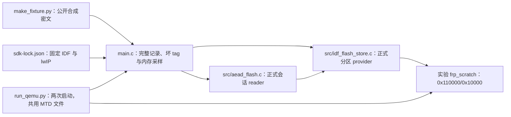

# C3 Flash scratch 仿真探针

本实验应用直接调用当前正式 `efrp_idf_flash_store_*` provider 与控制会话使用的 `efrp_aead_flash_reader_*`。它在 ESP32-C3 QEMU 的 MTD 文件中实际擦除、写入、读回独占 64 KiB `frp_scratch`，接收完整 65,568 字节 AES-256-GCM wire（65,536 字节明文），验证 tag、16 个明文窗口的完整复验、错误 tag 的零交付，以及第二次独立启动时的 boot recovery。它没有建立 FRPS、TLS、Yamux 或 `efrp_session_step`；这是一条正式 reader/provider 的设备软件探针，不是完整会话、产品资源峰值或实板验收。

## 架构拓扑



实验分区表只用于本目录独立应用，与独立 TCP 样例的布局相同；**不是** Base 候选的 `frp_scratch@0x3e6000`，也不修改任何产品正式分区。fixture 的 key、nonce 和 64 KiB 明文均由固定公式生成，没有真实 Token 或设备身份。构建时 IDF Python 环境需提供 `cryptography`；生成的 `.bin` 与 `.inc` 留在仓外 build 目录。应用静态嵌入密文，不在运行时申请 64 KiB 输入缓冲。`run_qemu.py` 只创建并修改仓外 4 MiB QEMU MTD 文件，输出目录必须不存在；不连接串口、不调用 `idf.py flash`。

## 运行

按仓根 [SDK 工具](../../tools/README.md)准备精确 ESP-IDF 与 lwIP，并安装支持 `-M esp32c3` 及 MTD drive 的 `qemu-system-riscv32`。在本仓根执行：

```bash
export IDF_PATH=/absolute/path/to/locked-esp-idf
source "$IDF_PATH/export.sh"
python3 tools/sdk.py check --path "$IDF_PATH"
idf.py -C tests/c3-flash-scratch -B /absolute/path/to/new-c3-flash-build \
  -D SDKCONFIG=/absolute/path/to/new-c3-flash-sdkconfig build
python tests/c3-flash-scratch/run_qemu.py \
  /absolute/path/to/new-c3-flash-build \
  /absolute/path/to/new-c3-flash-run
```

成功要求两次串口分别出现 `PHASE1_PASS`、`PHASE2_PASS`，runner 再按主机文件字节核对：第一次 scratch 完全等于 fixture 的 64 KiB 密文，第二次完全为 `0xff`，最后才打印 `QEMU_PASS`。每次原始串口日志、完整第一次 Flash 镜像、最终镜像、输入命令和 SHA-256 收据均保存在输出目录。失败时目录及原始输入不自动清理；检查 `phase-1.log`、`phase-2.log` 和 `merge.log`。应用打印 `MALLOC_CAP_8BIT` 的空闲字节与最大连续块，读写和完整 GCM 复验耗时；数字只适用于该实验应用和 QEMU。

[本轮真实运行记录](../../docs/operations/p6-c3-flash-scratch-qemu.md)列出固定版本、镜像摘要、原始日志位置、测量值与未覆盖边界。
