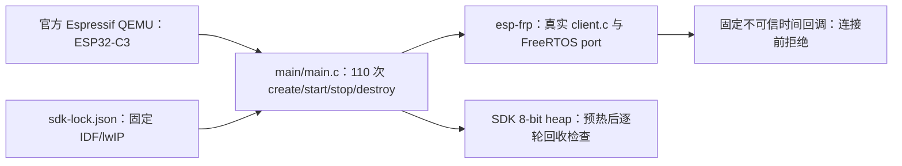

# C3 客户端生命周期故障探针

此 ESP32-C3 应用使用本仓真实 `efrp_create`、`efrp_start`、`efrp_get_status`、`efrp_stop` 与 `efrp_destroy`，在不可信时间条件下检验 worker 失败和同步回收。代码只有公开占位 CA、Token 和 `.invalid` 域名；时间回调固定返回 `false`，必须在 DNS、TCP、TLS 和 FRP 登录前拒绝连接。该入口用于官方 Espressif QEMU 软件验证，不读取设备配置或生产凭据。

## 架构拓扑



## 运行

先按仓根 [SDK 工具](../../tools/README.md)准备并导出精确 SDK，在仓根执行：

```bash
python3 tools/sdk.py check --path "$IDF_PATH"
idf.py -C tests/c3-lifecycle -B /absolute/path/frp-c3-lifecycle-build \
  -D SDKCONFIG=/absolute/path/frp-c3-lifecycle-sdkconfig build
idf.py -C tests/c3-lifecycle -B /absolute/path/frp-c3-lifecycle-build \
  qemu --qemu-extra-args=-no-reboot
```

串口出现 `EFRP_C3_LIFECYCLE PASS cycles=100 warmup=10` 且无 `fail`、`heap_loss`、panic 才算通过；应用返回后 QEMU 会保持空闲，可结束仿真。预热 10 次后的每轮空闲 heap 相对基线最多允许下降 512 字节，并逐轮检查失败状态为 `EFRP_TIME_UNTRUSTED`、一次尝试、零重试/就绪会话、停止后没有工作流，以及 destroy 清空句柄。

此探针不会建立实际网络会话，因此不验证 FRPS、TLS 握手、Wi-Fi、lwIP socket、DNS、背压、双流吞吐或实板资源峰值；P4-04 的正式实板矩阵仍须另行完成。该应用带 `ESP_FRP_LAB_ONLY` 标记，不是产品固件，也不用于设备写入。
