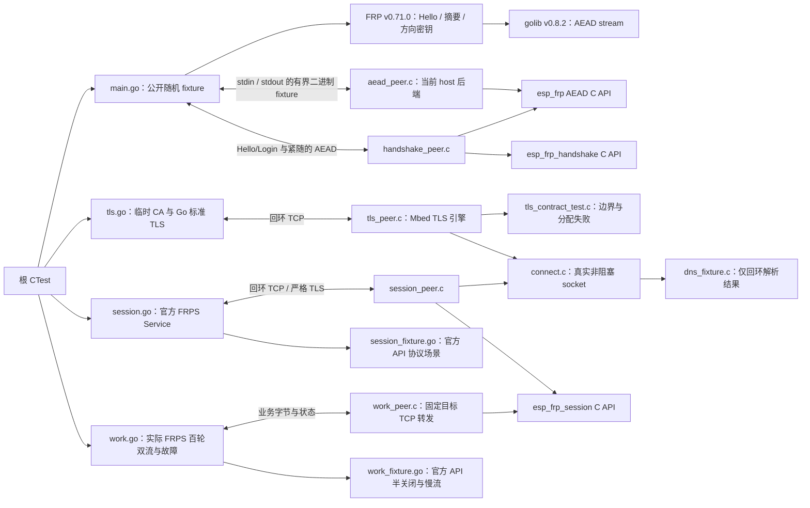

# FRP 控制会话与工作流互操作

## 架构拓扑

Go >=1.25，`go.mod` 与 `go.sum` 固定官方 FRP 及公开传递依赖。模块调用原始上游 API，不复制派生算法，不用相邻 checkout 的 replace。首次运行需要下载模块；fixture Token 与随机 Hello 只用于进程内测试，TLS 模式另外创建回环监听，没有真实凭据或生产 FRPS 连接。

从仓根启用 `-DEFRP_TEST_UPSTREAM_CRYPTO=ON` 后运行 CTest。单独调试可在本目录执行 `go run -mod=readonly . -peer /absolute/path/to/aead_peer`；peer 来自仓根 CMake 构建。CTest 总期限 120 秒，每个 C 子进程期限 10 秒。

12 组双向载荷包含 0、1、15、16、17、511、512、513、65535、65536、65537、300001 字节；官方 server 写入的记录交给 C client，C 回写后由官方 server 解密并逐字节比较，另直接比较原始 Hello 摘要。10 组拒绝覆盖 nonce/密文/tag、Token、客户端/服务端原文空白变化、尾部截断、方向反射和记录乱序。此处测试密码记录，不等同于 FRP 登录、Yamux/TLS 组合或实板验收。

同一选项还运行 `handshake_upstream`：官方解码 C 的 Login 并执行 TokenAuth.VerifyLogin，发送 Hello/LoginResp 与紧随的加密 Pong，再解码 C 的加密回写。9 组正例和 6 组拒绝用例见[握手合同](../../docs/design/control-handshake.md)。单独执行为 `go run -mod=readonly . -handshake-peer /absolute/path/to/handshake_peer`。这里只执行上游协议 API，没有启动完整 FRPS 或 TLS listener。

完整 Mbed TLS host 构建增加 `tls_upstream`，单独执行为 `go run -mod=readonly . -tls-peer /absolute/path/to/tls_peer`。先运行配置/取消/回调边界，再由 Go 标准 TLS 服务端与 C 引擎建立 113 条真实连接：100 次 TLS 1.3、TLS 1.2、强制分片、四类证书拒绝和七种终止场景。TLS 服务端不包含 FRP 会话；覆盖和限制见 [TLS 合同](../../docs/design/tls-transport.md)。

C peer 经当前 `connect.c` 建连及收发，终止时检查 fd 已释放。测试 DNS 只返回回环地址，不执行真实域名查询；其与 SDK 回调收敛的区别见 [连接生命周期](../../docs/design/connection-lifecycle.md)。

`session_upstream` 首次实际启动固定版本的 FRPS `server.NewService`，关闭 Dashboard，transport 与 proxy listener 明确绑定回环；使用临时 CA、证书和公开 fixture Token，启用 HeartBeats/NewWorkConns scopes。100 次注册/销毁、真实请求触发 ReqWorkConn、两个连续心跳、37/41 字节与 WOULD_BLOCK、Token/端口拒绝及两种取消逐项验证；官方返回 `:端口`，测试用已固定的 loopback 补齐连接地址。结束后确认代理监听撤销。

随后 `session_fixture.go` 以官方 API 构造 17 个组合边界场景，覆盖尾数据、4096 字节 payload、异常控制消息、截断、篡改、FIN 和期限。单独执行为 `go run -mod=readonly . -session-peer /absolute/path/to/session_peer`。这证明 host 上的控制会话，不是 C3 资源或实板通过，详见 [控制会话](../../docs/design/control-session.md)。

`go run -mod=readonly . -work-peer /absolute/path/to/work_peer` 通过实际 FRPS 完成百轮双流，每流两个方向各 300001 字节，另有应用回执防止服务端 EOF 全关闭语义截断测试载荷。添加 `-work-faults` 则执行四个真实 FRPS 故障用例及 12 个官方 API fixture；覆盖精确目标绑定、容量、半关闭、尾数据、错误字段、期限和慢流恢复。核心只消费已有固定依赖，无自写服务端密码算法；完整边界见 [工作流](../../docs/design/work-streams.md)。
