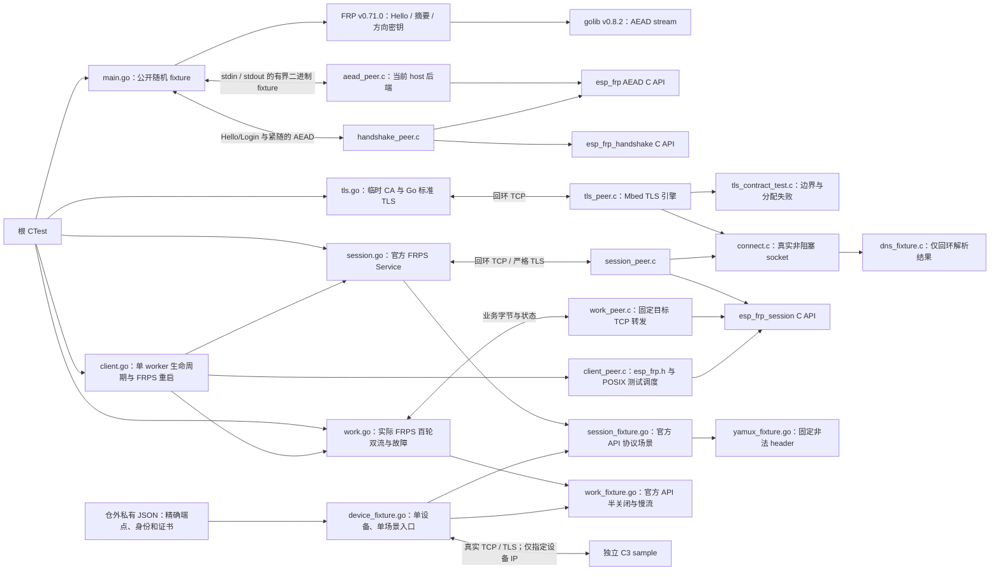

# FRP 控制会话与工作流互操作

## 架构拓扑



Go >=1.25，`go.mod` 与 `go.sum` 固定官方 FRP 及公开传递依赖。模块调用原始上游 API，不复制派生算法，不用相邻 checkout 的 replace。首次运行需要下载模块；host 测试的 Token 与随机 Hello 只用于进程内测试，TLS 模式另外创建回环监听。单设备入口仅消费显式私有实验配置，不读取生产配置。

从仓根启用 `-DEFRP_TEST_UPSTREAM_CRYPTO=ON` 后运行 CTest。单独调试可在本目录执行 `go run -mod=readonly . -peer /absolute/path/to/aead_peer`；peer 来自仓根 CMake 构建。CTest 总期限 120 秒，每个 C 子进程期限 10 秒。

12 组双向载荷包含 0、1、15、16、17、511、512、513、65535、65536、65537、300001 字节；官方 server 写入的记录交给 C client，C 回写后由官方 server 解密并逐字节比较，另直接比较原始 Hello 摘要。10 组拒绝覆盖 nonce/密文/tag、Token、客户端/服务端原文空白变化、尾部截断、方向反射和记录乱序。此处测试密码记录，不等同于 FRP 登录、Yamux/TLS 组合或实板验收。

同一选项还运行 `handshake_upstream`：官方解码 C 的 Login 并执行 TokenAuth.VerifyLogin，发送 Hello/LoginResp 与紧随的加密 Pong，再解码 C 的加密回写。9 组正例和 6 组拒绝用例见[握手合同](../../docs/design/control-handshake.md)。单独执行为 `go run -mod=readonly . -handshake-peer /absolute/path/to/handshake_peer`。这里只执行上游协议 API，没有启动完整 FRPS 或 TLS listener。

完整 Mbed TLS host 构建增加 `tls_upstream`，单独执行为 `go run -mod=readonly . -tls-peer /absolute/path/to/tls_peer`。先运行配置/取消/回调边界，再由 Go 标准 TLS 服务端与 C 引擎建立 113 条真实连接：100 次 TLS 1.3、TLS 1.2、强制分片、四类证书拒绝和七种终止场景。TLS 服务端不包含 FRP 会话；覆盖和限制见 [TLS 合同](../../docs/design/tls-transport.md)。

C peer 经当前 `connect.c` 建连及收发，终止时检查 fd 已释放。测试 DNS 只返回回环地址，不执行真实域名查询；其与 SDK 回调收敛的区别见 [连接生命周期](../../docs/design/connection-lifecycle.md)。

`session_upstream` 首次实际启动固定版本的 FRPS `server.NewService`，关闭 Dashboard，transport 与 proxy listener 明确绑定回环；使用临时 CA、证书和公开 fixture Token，启用 HeartBeats/NewWorkConns scopes。100 次注册/销毁、真实请求触发 ReqWorkConn、两个连续心跳、37/41 字节与 WOULD_BLOCK、Token/端口拒绝及两种取消逐项验证；官方返回 `:端口`，测试用已固定的 loopback 补齐连接地址。结束后确认代理监听撤销。

随后 `session_fixture.go` 构造 28 个组合边界场景，覆盖尾数据、4096 字节 payload、单条 64 KiB AEAD 明文、超长控制帧/AEAD 记录、异常控制消息、截断、篡改、FIN 和期限。八个 Yamux 场景在真实 TLS 后直接发送固定非法 header，检查版本、类型、旗标、信用、窗口溢出、未打开流、RST 与截断，不另实现服务端复用协议。单独执行为 `go run -mod=readonly . -session-peer /absolute/path/to/session_peer`。这证明 host 上的控制会话，不是 C3 资源或实板通过，详见 [控制会话](../../docs/design/control-session.md)。

`go run -mod=readonly . -work-peer /absolute/path/to/work_peer` 通过实际 FRPS 完成百轮双流，每流两个方向各 300001 字节，另有应用回执防止服务端 EOF 全关闭语义截断测试载荷。添加 `-work-faults` 则执行四个真实 FRPS 故障用例及 13 个官方 API fixture；覆盖精确目标绑定、容量、半关闭、尾数据、错误字段、期限和慢流恢复。核心只消费已有固定依赖，无自写服务端密码算法；完整边界见 [工作流](../../docs/design/work-streams.md)。

`work_peer` 的独立工作流分配钩子验证 4096 字节握手区至多同时存在一份，并在实际 FRPS 与故障场景结束后全部清零释放；这不代替 MCU allocator 峰值采样。

`client.go` 使用同一真实 FRPS 构造器，运行应用层 `esp_frp.h` 生命周期。`session.go` 允许测试显式停止并重新创建同一端口的 FRPS；`restart-active` 在两条活动流各交付一字节后停服，核对旧连接清理、同一 worker 重新注册和两条新流的完整双向字节，不用空闲 READY 代替活动中断恢复。`work.go` 另以 worker 运行三轮双流，随后保留两条本地连接验证停止清理。配置、信任、回调和调度边界见[客户端生命周期](../../docs/design/client-lifecycle.md)。

## 单设备协议 fixture

`go run -mod=readonly . -device-config /private/path/device-fixture.json` 复用上述场景，单次只接收一个明确 IP 的对端。配置必须是至多 16 KiB、无组/其他用户权限的普通 JSON 文件，拒绝未知字段；以下均为文档占位值：

```json
{
  "listen_ipv4": "192.0.2.10",
  "listen_port": 17400,
  "allowed_peer_ipv4": "192.0.2.20",
  "certificate_file": "/private/path/server.pem",
  "private_key_file": "/private/path/server.key",
  "mode": "fixture-aead-max",
  "token": "replace-with-isolated-fixture-token",
  "client_id": "isolated-c3",
  "proxy_name": "isolated-tcp",
  "timeout_ms": 25000
}
```

端口限定 1024–65535，期限为 1000–90000 ms；证书/私钥使用绝对路径。客户端必须按真实主机名和 CA 校验服务端，fixture 精确验证 Login 的 `client_id`、Token 和 NewProxy 的名称/类型/配置。IP 限定仅收窄实验对象，不能代替协议认证。

`mode` 支持 `sessionFixtureModes` 的 28 项，以及 `work-wrong-name`、`work-error`、`work-oversized`、`work-truncated`、`work-bad-port`、`work-duplicate`、`work-frame-timeout`、`work-idle`、`work-tail-fin`、`work-local-fin`、`work-spare`、`work-stall`、`work-shared`。`work-idle` 使用真实 60 秒空闲期限，fixture 应配置 90000 ms；工作流场景保留控制通道并响应认证心跳。

host 和 device 使用相同工作协议；前者的本地目标变换测试字节，后者按独立 C3 / ESP32 样例回显原字节。`work-tail-fin` 将 StartWorkConn 与首段业务粘连，此后每次写入至多 1 KiB 业务字节并读取等量回显，末段写入后发送 FIN；`work-local-fin` 先收齐本地载荷和 FIN，再按至多 1 KiB 分块发送反向载荷及 FIN。两种交换均避免测试端点以单次 300001 字节 Yamux 写入填满小窗口并互相等待。半关闭的每个方向各 300001 字节，不能只用 EOF 证明完整交付。

- `work-tail-fin`：StartWorkConn 紧随业务，远端先 FIN，核对返回数据。
- `work-local-fin`：启动前向样例发送 `echo_local_fin`；先核对本地数据与 FIN，随后才发送反向载荷，并与样例的完整逐字节证明联合验收。
- `work-spare`：打印 `phase=waiting-spare` 后等待标准输入的一行精确 `resume`；控制心跳继续。实板驱动应观察超过 60 秒的等待和没有本地 socket，再恢复握手与传输，使用 90000 ms 总期限。
- `work-shared`：启动 fixture 前先对空闲样例执行 `echo_stall`，使第一条本地连接保持暂停读取。fixture 给第一条流发送 1024 字节后打印 `phase=partial-handshake` 并等待 `resume`；驱动先验证一条 active、一条 waiting，再执行 `echo_reset`，只在命令成功且日志显示 `paused=1 pending_read=1` 后恢复。最后确认旧流 RST、第二条流完整双向字节及资源回收。若尚无待读字节，稍后重试 `echo_reset`，不能把命令已写入当成 RST 已发生。
- `work-stall`：启动前执行 `echo_stall`，向第一条流写入足以产生背压的数据，第二条流独立核对 64 字节回显；观察慢流结束后执行 `echo_resume`，回收样例目标端的 fd。

恢复输入最多 64 字节，非法行、EOF、信号或总期限终止场景；等待恢复不绕过 fixture 的连接期限。输入动作本身不访问设备，刷机和样例命令仍由外部驱动执行。

入口没有设备发现、刷机、DNS 服务、代理监听或生产安装操作。`ESP_FRP_DEVICE_FIXTURE_READY` 只说明监听建立，`ESP_FRP_DEVICE_WORK_FINISHED` 说明工作场景按其断言结束，`ESP_FRP_DEVICE_FIXTURE_FINISHED` 说明服务端场景结束；三者都不能单独作为实板通过。验收还须核对设备的精确错误、状态/资源回收，以及恢复到官方 FRPS 后的业务字节。私有配置、证书、输入和日志不得提交。
