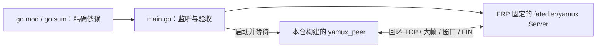

# 固定上游 Yamux 互操作

## 架构拓扑



这是独立的 host 测试模块，不进入固件依赖。仅使用上游公开 API；不复制 MPL-2.0 上游实现。根 [测试入口](../README.md) 通过 CTest 调用：

```bash
go run -mod=readonly . -client <yamux_peer绝对路径> -rounds 100
```

每个会话接受两条客户端流，各发送 300001 字节并精确核对完整回传，再验证对端 FIN。C peer 使用小 ring 和最多 113 字节的 transport 部分写入。任何一侧失败使本次检查失败；测试只绑定 `127.0.0.1`，不读取或连接生产 FRPS。
