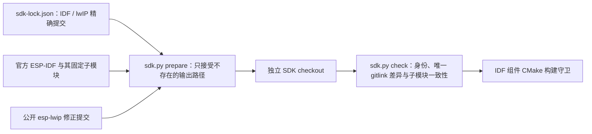

# SDK 准备与校验

`sdk.py` 只使用本仓 [sdk-lock.json](../sdk-lock.json)、Python 标准库、Git 和公开精确提交。它创建完整独立 ESP-IDF checkout，再将其 lwIP 子模块切到锁定修正提交；不会改动已有机器 SDK，也不从相邻工作区源码构建。

## 架构拓扑



```bash
python3 tools/sdk.py prepare --path "$HOME/.espressif/frameworks/esp-frp-idf"
bash "$HOME/.espressif/frameworks/esp-frp-idf/install.sh" esp32c3
source "$HOME/.espressif/frameworks/esp-frp-idf/export.sh"
python3 tools/sdk.py check --path "$IDF_PATH"
idf.py -C examples/tcp_proxy build
```

首次准备需要网络并下载官方子模块；失败时保留新目录供排障，后续不自动覆盖或修复已有路径。安装工具链与准备源码是独立动作，`prepare` 不刷写设备、创建 Secret 或发布制品。Git 可能把唯一锁定的 lwIP gitlink 显示为修改，这正是显式 SDK 装配合同；其他修改、未初始化子模块或提交漂移一律拒绝。

`check --quiet` 供构建调用；普通 host 协议测试不需要 ESP-IDF。准备检查的真实 Git fixture 回归：`python3 -m unittest discover -s tools/tests -p 'test_*.py'`。
