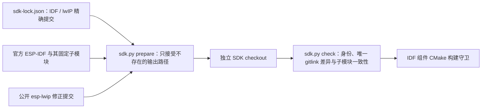

# SDK 准备与校验

`sdk.py` 只使用本仓 [sdk-lock.json](../sdk-lock.json)、Python 标准库、Git 和公开精确提交。它创建完整独立 ESP-IDF checkout，再将其 lwIP 子模块切到锁定修正提交；不会改动已有机器 SDK，也不从相邻工作区源码构建。

## 架构拓扑


```mermaid
flowchart LR
    lock["sdk-lock.json：IDF / lwIP 精确提交"] --> prepare["sdk.py prepare：只接受不存在的输出路径"]
    official["官方 ESP-IDF 与其固定子模块"] --> prepare
    fixed["公开 esp-lwip 修正提交"] --> prepare
    prepare --> sdk["独立 SDK checkout"]
    sdk --> check["sdk.py check：身份、唯一 gitlink 差异与子模块一致性"]
    check --> build["IDF 组件 CMake 构建守卫"]
```

```bash
python3 tools/sdk.py prepare --path "$HOME/.espressif/frameworks/esp-frp-idf"
bash "$HOME/.espressif/frameworks/esp-frp-idf/install.sh" esp32c3 esp32
source "$HOME/.espressif/frameworks/esp-frp-idf/export.sh"
python3 tools/sdk.py check --path "$IDF_PATH"
idf.py -C examples/tcp-proxy build
```

首次准备需要网络并下载官方子模块；失败时保留新目录供排障，后续不自动覆盖或修复已有路径。安装工具链与准备源码是独立动作，`prepare` 不刷写设备、创建 Secret 或发布制品。Git 可能把唯一锁定的 lwIP gitlink 显示为修改，这正是显式 SDK 装配合同；普通 `prepare` 显式忽略上游子模块的浅克隆建议，完整取得根与递归依赖；`check` 同时拒绝 shallow/partial/sparse 来源、缺失对象和文件或环境提供的外部对象库。来源 gitdir 与 common-dir 必须一致，对象目录及对象不能通过符号链接借用仓外存储；linked worktree 被拒绝，正常 absorbed submodule 的 `.git` 定位文件保留。每个递归来源显式检查工作树，不受 `submodule.*.ignore` 配置影响。其他修改、未初始化子模块或提交漂移一律拒绝。

`check --quiet` 供构建调用；普通 host 协议测试不需要 ESP-IDF。准备检查的真实 Git fixture 回归：`python3 -m unittest discover -s tools/tests -p 'test_*.py'`。

## QUIC 精确源码

0.3.0 的完整 Mbed TLS host 模式和 ESP-IDF 组件都消费 [quic-lock.json](../quic-lock.json) 中同一组 ngtcp2/Picotls。完整 TLS/QUIC host 模式使用三个不存在的仓外目录（仅 IDF 的 QUIC 准备可省略 host 参数；独立 PSA 模式只准备 host 组）：

```bash
python3 tools/quic_sources.py prepare \
  --ngtcp2-path /absolute/path/to/esp-frp-ngtcp2 \
  --picotls-path /absolute/path/to/esp-frp-picotls \
  --host-mbedtls-path /absolute/path/to/mbedtls-4.1.0
```

`prepare` 以无 filter、无 depth 的完整提交与递归精确 gitlink 物化受控来源；ngtcp2、Picotls 及真实命中的 URL 解析子源各自保留原上游完整提交追溯，普通 C/TLS 源码不变。已有目录用 `check` 替代 `prepare`，不会覆盖或修改 checkout。host `cmake` 和 IDF `idf.py` 均添加 `-DEFRP_NGTCP2_SOURCE_DIR=/absolute/path/to/esp-frp-ngtcp2` 与 `-DEFRP_PICOTLS_SOURCE_DIR=/absolute/path/to/esp-frp-picotls`。构建检查独立 Git 根、完整 SHA 和未提交修改，不能用相邻工作区或改写依赖来绕过守卫。基础 OpenSSL／独立 PSA 协议矩阵不消费 QUIC。

原型和正式组件共用根锁、源守卫及第一方 crypto；正式装配由 `tools/quic_dependencies.cmake` 定义；原型仅作为独立测试入口。两个 target 并行构建需各自独立源码目录，不能共享 Component Manager 的 `managed_components` 目录。实际运行、资源与验收范围见[流传输合同](../docs/design/stream-transport.md)。

SDK 的 Actions 退出来源以原 `esp-space/esp-idf@578cf89c343e388db43ba1f4ddcd602fedcb763c` 为业务基线，只追加源码退出与实际嵌套来源绑定；受控来源的 `workspace-source.json` 保留精确上游追溯。lwIP 锁需在源码退出 PR 合入 `darren-you/esp-lwip` canonical `master` 后再选择精确版本，当前不使用未合并任务 head；源码变更不代表固件、Broker、实板或发布已完成。

host Mbed TLS 保持官方 4.1.0 / TF-PSA 1.1.0 业务版本，来源为既有受控仓的精确 host source commit 与 [原生完整源 Release](https://github.com/darren-you/reference-sdk-mbedtls/releases/tag/v4.1.0)。`prepare` 完整物化 Git 与精确子源，实际读取锁定 Release 归档并核摘要，再从该 Git 源重建归档比对；不会保留平行缓存。31 个官方生成文件与 `GEN_FILES=OFF` 合同完整，2 处生成注释归位差异在源仓 `workspace-source.json` 明示，不能称与官方包逐字节相同。`check` 和构建守卫独立从固定 Git 版本的干净完整递归来源重建归档并核对同一摘要，无需网络或先前 `prepare` 成功；来源不得通过 alternates 或环境借用其他对象库，不能用原含 Actions 的官方归档代替。上述取源不授予 TLS/Broker/固件或设备运行资格。
